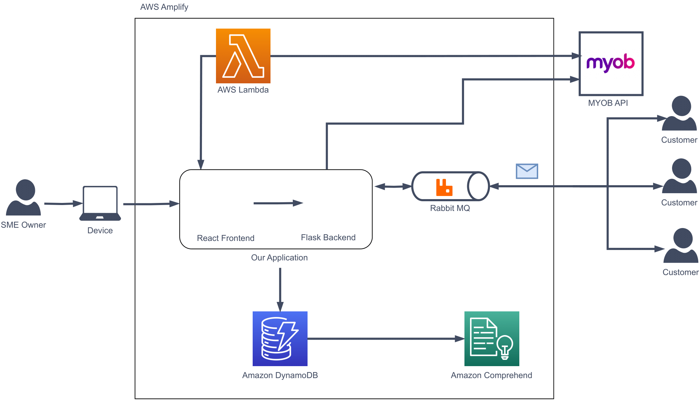

# myob-it-challenge-public

Rev-you is an app that connects a business owner's digital invoices with granular insights on their products and services from their customers, allow them to submit their feedback on their recent purchases without leaving their email client. 

This app was developed for the MYOB IT Challenge 2021, and placed 1st out of 120 teams across Australia and New Zealand: https://www.auckland.ac.nz/en/news/2021/09/03/university-of-auckland-students-win-trans-tasman-it-challenge.html

Details:
- Cloud-based web application that provides granular insights on a business’ products and services by allowing customers to submit feedback on their orders directly via their email clients
- Backend developed using Flask and MongoDB, frontend developed using React
- Prepared a 10-minute presentation for MYOB executives outlining our customer analysis, market
research, and technical architecture: https://youtu.be/RRvTa27t5fE?t=203

Contributors:
- Emily Zou (backend, frontend)
- Nicholas Kondal (backend, problem formulation)
- Sonia Wang (frontend, problem formulation)
- Laith Saeed (problem formulation, architecture)